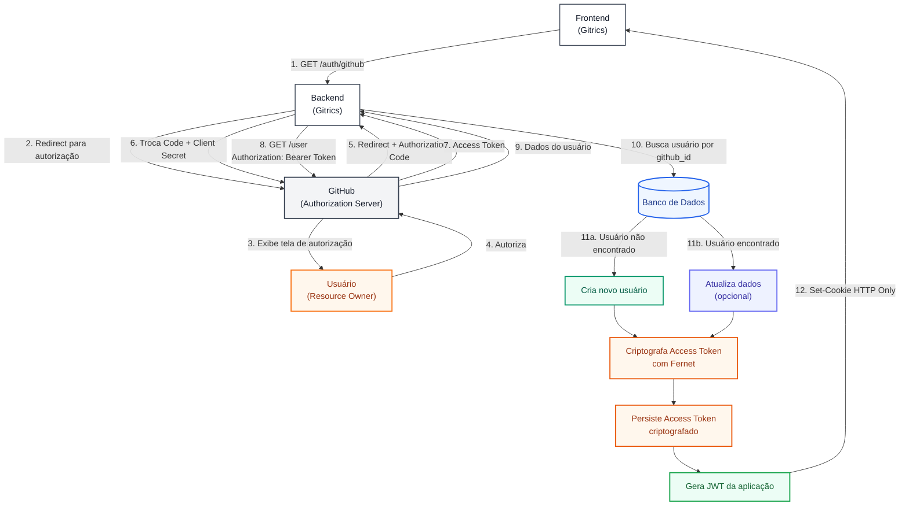
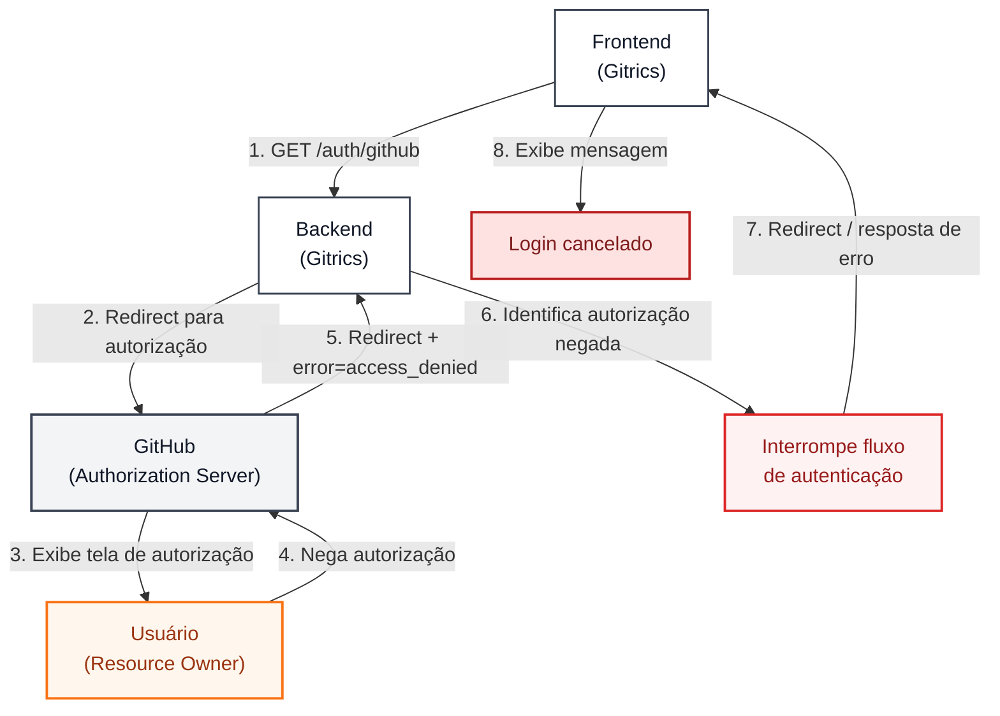

# Autenticação com GitHub — OAuth 2.0

A aplicação utiliza o **OAuth 2.0 Authorization Code Flow** para autenticar usuários através do GitHub.

O GitHub atua como **Authorization Server**, enquanto o backend da aplicação é responsável por realizar a troca do `Authorization Code` pelo `Access Token`, obter os dados do usuário e criar a sessão da aplicação.

O fluxo é dividido em dois cenários:

- **Autorização concedida:** o usuário autoriza o acesso à aplicação.
- **Autorização negada:** o usuário recusa o acesso solicitado pelo GitHub.

---

## Fluxo 1 — Autorização concedida



### Passos

1. **Frontend → Backend:** o usuário clica em "Entrar com GitHub" e o frontend inicia o fluxo através do endpoint `/auth/github`.

2. **Backend → GitHub:** o backend redireciona o usuário para a página de autorização do GitHub.

3. **GitHub → Usuário:** o GitHub apresenta ao usuário as permissões solicitadas pela aplicação.

4. **Usuário → GitHub:** o usuário autoriza o acesso solicitado.

5. **GitHub → Backend:** o GitHub redireciona o usuário de volta para o backend contendo um `Authorization Code`.

6. **Backend → GitHub:** o backend realiza uma requisição server-to-server para trocar o `Authorization Code` por um `Access Token`, utilizando também o `Client Secret`.

7. **GitHub → Backend:** o GitHub retorna o `Access Token`.

8. **Backend → GitHub:** utilizando o `Access Token`, o backend realiza uma requisição para a API do GitHub para obter os dados do usuário.

9. **GitHub → Backend:** o GitHub retorna informações do usuário, como `github_id`, e-mail, nome e avatar.

10. **Backend → Banco de Dados:** o backend procura um usuário existente utilizando o `github_id`.

11. **Persistência do usuário:**
    - Se o usuário não existir, um novo usuário é criado.
    - Se o usuário já existir, seus dados podem ser atualizados.

12. **Proteção do Access Token:** o `Access Token` recebido do GitHub é criptografado utilizando **Fernet** antes de ser armazenado no banco de dados.

13. **Persistência:** o token criptografado é associado ao usuário e persistido no banco de dados.

14. **Geração da sessão:** o backend gera um **JWT próprio da aplicação**, utilizado para autenticar as próximas requisições do usuário.

15. **Backend → Frontend:** o JWT é enviado ao frontend através de um cookie.

---

# Fluxo 2 — Autorização negada



### Passos

1. **Frontend → Backend:** o usuário inicia o login através do endpoint `/auth/github`.

2. **Backend → GitHub:** o backend redireciona o usuário para a página de autorização do GitHub.

3. **GitHub → Usuário:** o GitHub apresenta as permissões solicitadas pela aplicação.

4. **Usuário → GitHub:** o usuário nega a autorização.

5. **GitHub → Backend:** o GitHub redireciona o usuário de volta para o backend informando o erro `access_denied`.

6. **Backend:** identifica que o usuário negou a autorização e interrompe o fluxo de autenticação.

7. **Backend → Frontend:** o backend redireciona o usuário para o frontend informando que a autorização foi negada.

8. **Frontend:** apresenta uma mensagem informando que o login foi cancelado.

---

# Tokens utilizados

A aplicação trabalha com dois tokens diferentes, cada um com uma finalidade específica.

## GitHub Access Token

O `Access Token` fornecido pelo GitHub é utilizado exclusivamente pelo backend para acessar a API do GitHub em nome do usuário.

```text
GitHub
   │
   │ Access Token
   ▼
Backend
   │
   │ API do GitHub
   ▼
GitHub
```

Esse token é considerado um dado sensível.

Por isso, antes de ser armazenado no banco de dados, ele é criptografado utilizando **Fernet**.

```text
Access Token
     │
     ▼
Fernet Encryption
     │
     ▼
Encrypted Access Token
     │
     ▼
Database
```

---

## JWT da aplicação

O JWT é um token próprio da aplicação e não é utilizado para acessar a API do GitHub.

Sua responsabilidade é identificar e autenticar o usuário nas requisições feitas ao backend.

O JWT é enviado ao frontend através de um cookie.

```text
Backend
   │
   │ JWT
   ▼
Cookie
   │
   ▼
Frontend
```

Nas próximas requisições:

```text
Frontend
   │
   │ Cookie: JWT
   ▼
Backend
   │
   ├── Valida JWT
   │
   ├── Identifica usuário
   │
   ├── Busca usuário no banco
   │
   ├── Recupera Access Token criptografado
   │
   ├── Descriptografa Access Token
   │
   └── Acessa API do GitHub
```

---

# Resumo da arquitetura

```text
                         ┌──────────────────────┐
                         │       GitHub         │
                         │  Authorization       │
                         │      Server          │
                         └──────────┬───────────┘
                                    │
                              Authorization
                                  Code
                                    │
                                    ▼
                         ┌──────────────────────┐
                         │       Backend        │
                         │       Gitrics        │
                         └──────────┬───────────┘
                                    │
                             Access Token
                                    │
                                    ▼
                         ┌──────────────────────┐
                         │  Fernet Encryption   │
                         └──────────┬───────────┘
                                    │
                                    ▼
                         ┌──────────────────────┐
                         │      Database        │
                         │                      │
                         │ Encrypted Token      │
                         │ User Data            │
                         └──────────────────────┘

                                    │
                                  JWT
                                    │
                                    ▼
                         ┌──────────────────────┐
                         │      Frontend        │
                         │       Cookie         │
                         └──────────────────────┘
```

## Separação de responsabilidades

| Token | Responsabilidade | Armazenamento |
|---|---|---|
| `Authorization Code` | Intermediar a autenticação OAuth | Temporário |
| `GitHub Access Token` | Acessar a API do GitHub | Banco, criptografado com Fernet |
| `JWT` | Autenticar o usuário no Gitrics | Cookie |

O **GitHub Access Token** nunca precisa ser enviado ao frontend. O frontend trabalha apenas com a sessão/autenticação da aplicação através do JWT.