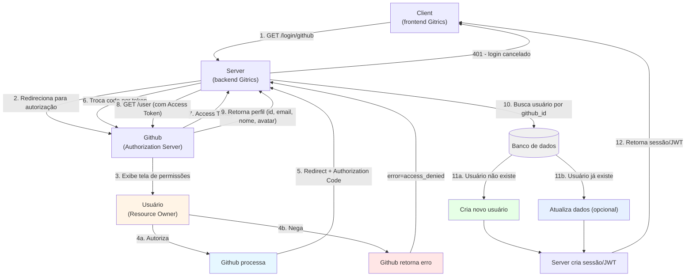

# Fluxo de login com GitHub (OAuth2)

## Passos

## Passos

1. **Client → Server**: usuário clica em "Entrar com GitHub", frontend chama `/login/github`.
2. **Server → Usuário**: redireciona o navegador do usuário para a tela de autorização do GitHub.
3. **Usuário decide**: autoriza ou não o acesso.
4. **Se autoriza**: GitHub redireciona de volta ao Server com um `Authorization Code`.
5. **Server → GitHub**: troca o código por um `Access Token` (chamada server-to-server, com `client_secret`).
6. **Server → GitHub**: usa o `Access Token` para buscar o perfil do usuário (`GET /user`), obtendo `github_id`, e-mail, nome e avatar.
7. **Server → Banco de dados**: busca um usuário existente por `github_id`.
8. **Se não existe**: cria um novo registro de usuário com os dados vindos do GitHub.
9. **Se já existe**: opcionalmente atualiza campos como avatar, nome ou último login.
10. **Server → Client**: cria sessão/JWT e responde ao frontend que o login foi concluído.
11. **Se o usuário recusa**: GitHub redireciona com erro (`error=access_denied`); o Server responde com `401` ao Client.
